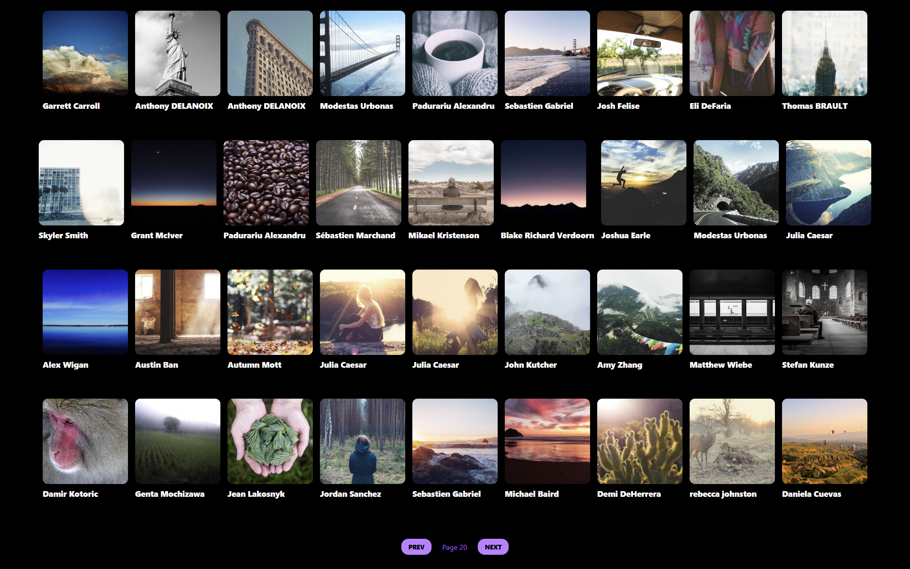
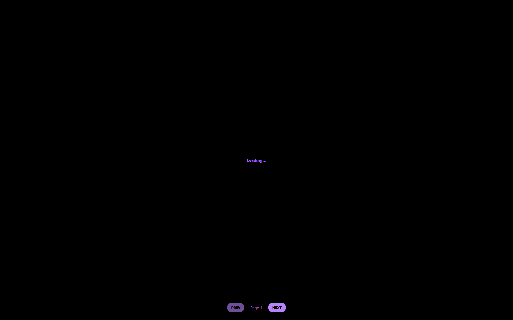
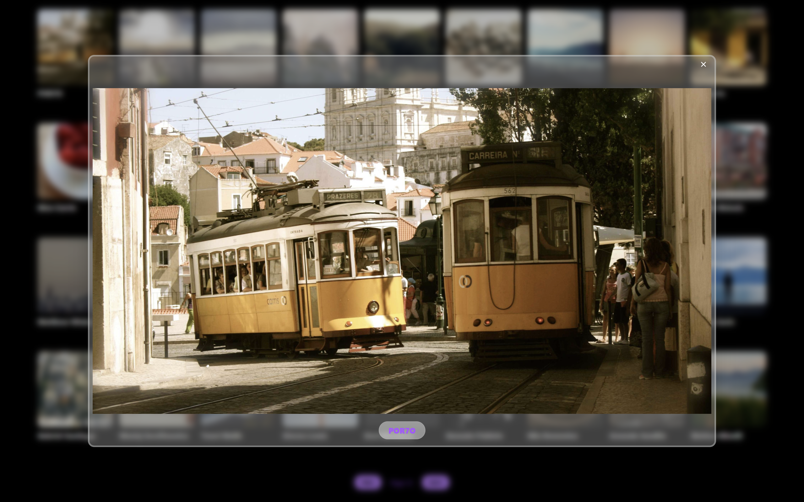
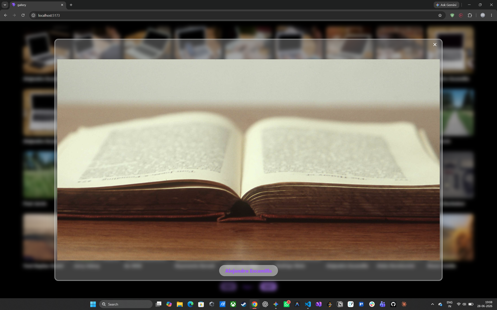

# 📸 Gallery App

A responsive photo gallery application built with React and Tailwind CSS, powered by the Lorem Picsum API. Browse thousands of high-quality photographs with pagination, hover interactions, and a full-screen preview modal.

---

## 🖥️ Screenshots

### Home — Page 20


### Home — Page 21


### Loading State


### Preview Modal


### Preview Modal — Author Display


---

## ✨ Features

- **Paginated Gallery** — 36 high-resolution photos loaded per page via the Lorem Picsum API
- **Full-Screen Preview Modal** — click any image to open an expanded preview with a glassmorphism backdrop
- **Author Attribution** — each photo displays the photographer's name on the card and in the preview
- **Loading State** — visual feedback while images are being fetched between page transitions
- **Hover Interactions** — smooth scale animation on image hover, active press feedback on buttons
- **Outside Click to Close** — clicking outside the preview modal closes it via event propagation handling
- **Responsive Layout** — flex-wrap grid adapts to any screen width

---

## 🛠️ Tech Stack

| Technology | Purpose |
|---|---|
| **React 19** | Component architecture, state management |
| **Vite** | Build tool and development server |
| **Tailwind CSS** | Utility-first styling |
| **Axios** | HTTP client for API requests |
| **Remix Icon** | Icon library (`RiCloseFill` for modal close) |
| **Lorem Picsum API** | Free high-quality photography API |

---

## 📁 Project Structure

```
Gallery-Webapplication/
├── Gallery/
│   ├── node_modules/
│   ├── public/
│   ├── src/
│   │   ├── assets/
│   │   ├── components/
│   │   │   ├── Card.jsx         
│   │   │   └── Container.jsx     
│   │   ├── App.jsx               
│   │   ├── index.css             
│   │   └── main.jsx             
│   ├── .gitignore
│   ├── eslint.config.js
│   ├── index.html
│   ├── package-lock.json
│   ├── package.json
│   ├── README.md
│   └── vite.config.js
└── screenshots/
    ├── HomePage20.png
    ├── HomePage21.png
    ├── Loading.png
    ├── Preview.png
    └── Preview2.png
```

---

## 🚀 Getting Started

### Prerequisites
- Node.js v18+
- npm v9+

### Installation

```bash
# Clone the repository
git clone https://github.com/your-username/gallery-app.git

# Navigate into the project
cd gallery-app

# Install dependencies
npm install

# Start the development server
npm run dev
```

Open [http://localhost:5173](http://localhost:5173) in your browser.

---

## 🔌 API Reference

This project uses the **[Lorem Picsum API](https://picsum.photos)** — a free, no-auth photography API.

| Endpoint | Usage |
|---|---|
| `https://picsum.photos/v2/list?page={n}&limit=36` | Fetch paginated list of photos |
| `https://picsum.photos/id/{id}/400/400` | Optimised thumbnail for gallery cards |
| `https://picsum.photos/id/{id}/4096/2160` | Full-resolution image for preview modal |

---

## ⚙️ How It Works

### Pagination
```
Index state (page number)
    ↓
useEffect fires on Index change
    ↓
Axios fetches new page from Picsum API
    ↓
setUserData triggers re-render with new photos
```

### Preview Modal
```
User clicks a Card
    ↓
onImageClick sets selectedImage state in App.jsx
    ↓
Container renders conditionally based on selectedImage
    ↓
e.stopPropagation() prevents outside-click from firing inside modal
    ↓
closePreview sets selectedImage back to null → modal unmounts
```

---

## 🎨 Design Decisions

- **Purple accent (`#a855f7`)** — consistent color identity across loading text, pagination, and author labels
- **Glassmorphism modal** — `backdrop-blur` + `bg-white/25` + `border-white/30` creates depth without heavy overlays
- **`setUserData([])`** before page change — intentionally clears images to show the loading state during transition, giving the user clear feedback that something is happening
- **Optimised image URLs** — card thumbnails use `400/400` while modal uses `4096/2160`, keeping page load fast without sacrificing preview quality

---

## 📦 Installing Dependencies

After cloning, all dependencies install automatically with `npm install`. To add them individually:

```bash
# Tailwind CSS + Vite plugin
npm install tailwindcss @tailwindcss/vite

# Axios — HTTP client
npm install axios

# Remix Icon — React icon library
npm install @remixicon/react
```

Then add the Tailwind plugin to `vite.config.js`:

```js
import tailwindcss from '@tailwindcss/vite'

export default defineConfig({
  plugins: [react(), tailwindcss()],
})
```

And import Tailwind in `index.css`:

```css
@import "tailwindcss";
```

---

## 🗺️ Roadmap

- [ ] Search by keyword or author name
- [ ] Filter by image orientation (landscape / portrait)
- [ ] Favourite photos saved to localStorage
- [ ] Keyboard navigation in preview modal (← → arrows)
- [ ] Download button in preview modal

---
> Built as part of a structured React learning journey — covering `useEffect`, API integration, and component architecture.
---

## Author

**PARTH PUNGAONKAR**
---
